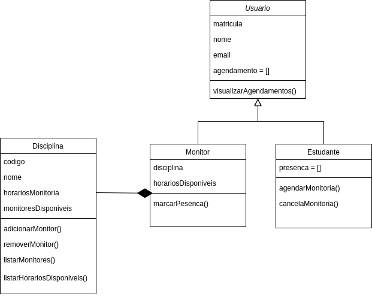

# Documentação do Sistema de Monitorias IMD

Este documento contém um diagrama de classes do projeto e descreve a estrutura e funcionalidades do Sistema de Monitorias do IMD, composto por quatro classes: `Usuario`, `Monitor`, `Estudante` e `Disciplina`. 

## Diagrama "UML"

### Classe `Usuario`

#### Atributos:
- `matricula`: Número de identificação única do usuário.
- `nome`: Nome completo do usuário.
- `email`: Endereço de e-mail do usuário.
- `agendamento`: Lista de agentamentos.

#### Métodos:
- `visualizarAgendamentos()`: Método que permite ao usuário visualizar seus agendamentos.

### Classe `Monitor` (Herda de `Usuario`)

#### Atributos:
- `disciplina`: Disciplina que o monitor está responsável por auxiliar.
- `horariosDisponiveis`: Lista de horários nos quais o monitor está disponível.

#### Métodos:
- `marcarPresenca()`: Registra a presença do estudante na monitoria.

### Classe `Estudante` (Herda de `Usuario`)

#### Atributos:
- `presenca`: Lista de monitorias nas quais o estudante está presente.

#### Métodos:
- `agendarMonitoria()`: Método que permite ao estudante agendar uma monitoria.
- `cancelarMonitoria()`: Método que permite ao estudante cancelar uma monitoria previamente agendada.

### Classe `Disciplina`

#### Atributos:
- `codigo`: Código único da disciplina.
- `nome`: Nome da disciplina.
- `horariosMonitoria`: Lista de horários disponíveis para monitoria.
- `monitores`: Lista de monitores disponíveis para a disciplina.

#### Métodos:
- `adicionarMonitor()`: Método que adiciona um monitor à lista de monitores disponíveis.
- `removerMonitor()`: Método que remove um monitor da lista de monitores disponíveis.
- `listarMonitores()`: Método que retorna a lista de monitores disponíveis para a disciplina.
- `listarHorariosDisponiveis()`: Método que retorna a lista de horários disponíveis para monitoria na disciplina.
